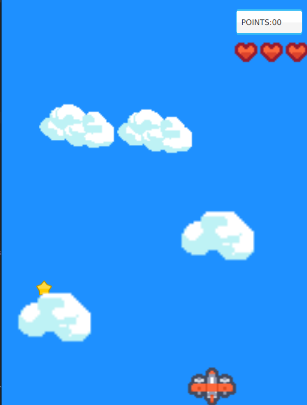

# PlaneRunner

This game was created in Java using JavaFX.

The aim of the game is to collect as many stars as posible which give you points, while avoiding clouds. If you hit a cloud you loose a life until you run out of lives and lose. 

#### Controls
* Left arrow: move left
* Right arrow: move right

#### Downfalls
Unfortunately the way it is programmed currently, the game performace (& playability) is tied to the CPU performace of the system it is run on. Meaning that it may run too fast or too slow depending on the system compared to the one it was programed on. This is a thing that can be fixed to improve the game.

#### Asset Sources
* https://kenney.nl/assets/ui-pack
* https://kenney.nl/assets/pixel-shmup
* https://latenightcoffe.itch.io/2d-pixel-art-semi-realistic-clouds
* https://cartooncoffee.itch.io/sunnycloud
